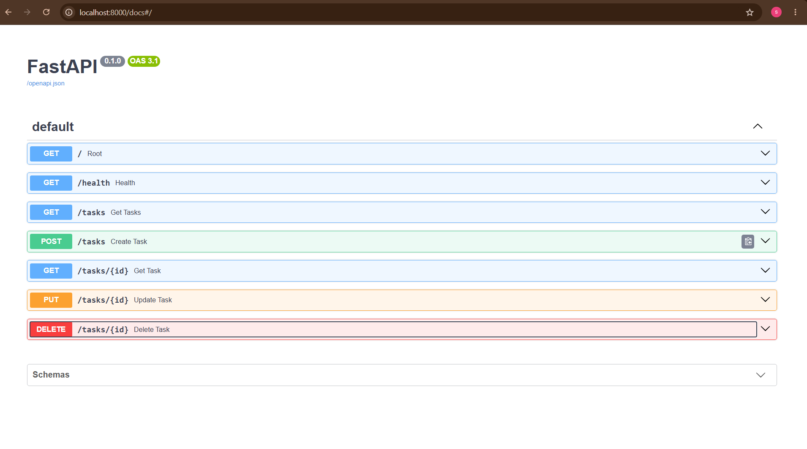

# CRUD API
## What is CRUD?
Create, Read, Update, Delete — the classic to-do list logic: create a new 
task, list tasks, update a task, and delete a task.
## Where is the data stored?
Data is stored in memory (RAM), so when the server restarts, only the 
original seed list will be visible — any changes made during runtime 
will be lost.
## Technologies
- Python 3.12.10
- FastAPI
- Uvicorn

## Endpoints
| Method | Endpoint |  Description |
|--------|----------|----------|
| GET | / | API info |
| GET | /health | Health check  |
| GET | /tasks | List all tasks |
| POST | /tasks | Create a new task |
| GET | /tasks/{id} | Get a specific task |
| PUT | /tasks/{id} | Update a task's fields |
| DELETE | /tasks/{id} | Delete a task |
 
## Example Usage

```bash
curl -i -X DELETE http://localhost:8000/tasks/99
```

**Response:**

```
HTTP/1.1 404 Not Found
date: Sun, 16 Aug 2026 12:18:46 GMT
server: uvicorn
content-length: 29
content-type: application/json
{"error":"Task 99 not found"}
```
## Swagger UI

## Installation & Running

1. Clone the repository:
```bash
git clone https://github.com/SUNAYILDIZ/flyrank-w2-crud-api.git 
cd flyrank-w2-crud-api
```

2. Create and activate a virtual environment:
```bash
python -m venv venv
# Windows:
venv\Scripts\Activate.ps1
# Mac/Linux:
source venv/bin/activate
```

3. Install dependencies:
```bash
pip install -r requirements.txt
```

4. Start the server:
```bash
uvicorn main:app --reload
```

5. Open in browser:  `http://localhost:8000`


